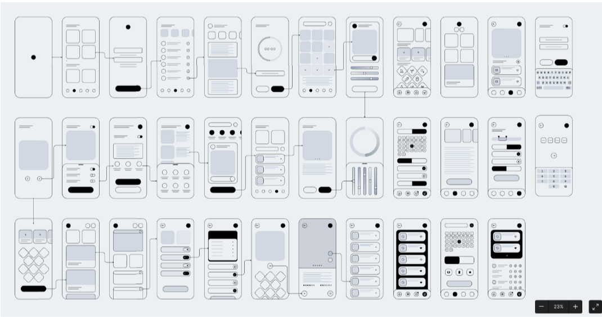

# Dream Team Tasks

## Table of Contents
- [What is the Dream Team?](#what-is-the-dream-team)
- [Submission Guidelines](#submission-guidelines)
- [Task List](#task-list)
- [Task 00: Linux](#task-00-linux)
- [Task 01: CLI & Git](#task-01-cli--git)
- [Task 02: The Open Source Conventions & Google Dorking](#task-02-the-open-source-conventions--google-dorking)
- [Task 03: Automate the Boring Stuff!](#task-03-automate-the-boring-stuff)
- [Task 04: Web Dev Basics](#task-04-web-dev-basics)
- [Development Cycle](#development-cycle)
- [Task 05: Not a SRS Doc](#task-05-not-a-srs-doc)
- [Task 06: Wireframe the Skeleton](#task-06-wireframe-the-skeleton)
- [Task 07: Figma Design Task](#task-07-figma-design-task)
- [Task 08: Frontend Development](#task-08-frontend-development)
- [Task 09: Backend Development](#task-09-backend-development)
- [References & Acknowledgments](#references--acknowledgments)

## What is the Dream Team?

The Dream Team is a student-led club offering exclusive 3-year internship opportunities designed to help you build and refine your skills through real-world projects. Upon successful completion of the assigned tasks and approval from reviewers, you will become eligible for a three-year, industry-level internship. During this internship, you will collaborate with experienced developers and be mentored by university alumni, gaining hands-on experience in modern tech stacks and tools. This practical exposure will set you apart from your peers and provide a significant advantage when preparing for campus placements in your final year.

## Submission Guidelines

1. **Set up a private GitHub repository named `dreamteam-tasks`.**

2. **Create directories named `task-##`** (where `##` corresponds to the task number) to organize your work for each specific task.

3. **Add a `README.md` file inside each task folder** with a brief explanation of your approach, along with your personal review of the task.

## Task List

| Task No. | Task Name                                             |
|----------|-------------------------------------------------------|
| 00       | [Linux](#task-00-linux)                               |
| 01       | [CLI & Git](#task-01-cli--git)                        |
| 02       | [The Open Source Conventions & Google Dorking](#task-02-the-open-source-conventions--google-dorking) |
| 03       | [Automate the Boring Stuff!](#task-03-automate-the-boring-stuff) |
| 04       | [Web Dev Basics](#task-04-web-dev-basics)             |
| 05       | [Not a SRS Doc](#task-05-not-a-srs-doc)               |
| 06       | [Wireframe the Skeleton](#task-06-wireframe-the-skeleton) |
| 07       | [Figma Design Task](#task-07-figma-design-task)       |
| 08       | [Frontend Development](#task-08-frontend-development) |
| 09       | [Backend Development](#task-09-backend-development)   |

## TASK 00: Linux

**Why Linux?**

- **Open source**: Linux's source code is accessible to anyone, which means not only can it be reviewed by the public, but there is also a large community ready to provide support when issues arise. Additionally, Linux is more secure compared to other closed-source operating systems.
- **Ease of development**: Programming and development, in general, are significantly enhanced on Linux compared to other OSes.
- **Hands-on learning**: Using Linux encourages a deeper understanding of how an operating system works under the hood, offering a valuable learning experience.

Read more about Linux [here](https://opensource.com/resources/linux).

**Installation and Dual-booting**

It is generally recommended to use the latest LTS release of Ubuntu (24.04.1 at the time of writing) or Fedora (Workstation 40 at the time of writing).

- [Install Ubuntu desktop | Ubuntu tutorials](https://ubuntu.com/tutorials/install-ubuntu-desktop#1-overview)
- [How To Install Ubuntu Along With Windows - It's FOSS](https://itsfoss.com/install-ubuntu-dual-boot-mode-windows/)
- [Getting Started :: Fedora Docs](https://docs.fedoraproject.org/en-US/fedora/latest/getting-started/)
- [How to Dual Boot Fedora and Windows](https://itsfoss.com/dual-boot-fedora-windows/)

For common issues faced during installation, visit: [Common Installation Issues](https://github.com/amfoss/vidyaratna/blob/initial/beginners/0_install_linux.md#common-errors-and-issues).

**Duration**: Until the objectives are met.

## TASK 01: CLI & GIT

First, we will explore the CLI by completing [Bandit](https://overthewire.org/wargames/bandit/). The goal is to complete up to **Level 20**.

Next, we will dive into Git, mastering commands that range from basic to advanced operations.

[Git exercises](https://gitexercises.fracz.com/) is a great platform to help you learn, practice, and discover Git features you might not be aware of.

Additionally, [Learn Git Branching](https://learngitbranching.js.org/) provides an interactive way to learn Git through visual Git graphs, offering hands-on practice with branching, merging, rebasing, and other Git concepts.

**Objectives:**

- Complete [Bandit](https://overthewire.org/wargames/bandit/) up to **Level 20**.
- Complete all exercises in Git exercises, take a screenshot of the congratulatory page, and upload it to your repository.
- Write a blog about this task, detailing your solutions to each exercise. The structure is open-ended: you can write a summary on GitHub Gist, publish a blog on Medium, or post it on your personal website. You may use the same or different blog/write-ups for Bandit, Learn Git Branching, and Git exercises.

**Resources:**

- https://git-scm.com/docs
- `man git`

**Duration: 5 days**

## TASK 02: The Open Source Conventions & Google Dorking

In this task, you will explore the conventions used in open-source projects, including coding styles, documentation standards, contribution guidelines, licensing, and community engagement. Additionally, you will learn about Google Dorking, a technique used to leverage advanced Google search operators to find specific information online.

**Objectives:**

- Gain an understanding of different open-source licenses (MIT, GPL, Apache, etc.) and when to use each one.
- Explore typical contribution workflows, including forking, pull requests, and code reviews.
- Choose one well-known open-source project (such as Linux, React, or TensorFlow) and analyze its contribution guidelines, license, documentation structure, and community engagement.
- Learn about Google Dorking through the [Google Dorking](https://tryhackme.com/r/room/googledorking) room on TryHackMe. Understand its applications and ethical considerations.
- Write a blog summarizing the conventions you learned about, comparing open-source licenses, explaining how to contribute effectively, and highlighting key takeaways from studying the chosen open-source project.

**Resources:**

- [Choose a License](https://choosealicense.com/)
- [Git Best Practices](https://sethrobertson.github.io/GitBestPractices/)
- [Conventional Commits](https://www.conventionalcommits.org/en/v1.0.0/)
- [Google Dorking on TryHackMe](https://tryhackme.com/r/room/googledorking)

**Duration: 3 Days**

## TASK 03: Automate the Boring Stuff!

In this task, you will delve into the world of automation using Python. [Automate the Boring Stuff](https://automatetheboringstuff.com/) is an excellent resource for learning how to write scripts that can automate everyday tasks, from file handling to web scraping. By completing the exercises in this book, you’ll gain practical experience in programming while discovering how to streamline tedious processes.

**Objectives:**

- Complete **Chapters 12-18** from [Automate the Boring Stuff](https://automatetheboringstuff.com/), following the instructions carefully.
- Write clean, well-documented code as you progress through the exercises.

**Duration: 5 Days**

## TASK 04: Web Dev Basics

Using the [Div_It_Up Repository](https://github.com/JATAYU000/Div_It_Up), develop a strong foundation in web development through projects, quizzes, discussions, and practical assignments, as well as Git.

**Objectives:**

- Begin each lesson with a pre-lecture quiz to assess your current knowledge.
- Dive into the lecture material to explore each subtopic in detail, engage in interactive activities, and reinforce your learning with a post-lecture quiz.
- After completing each lesson, work on the assignment to apply what you've learned.
- Focus on component-based coding to help you understand how to structure applications with reusable components.
- Only the best solutions for each task will be merged into this repository. Detailed submission instructions can be found in the [README.md](https://github.com/JATAYU000/Div_It_Up/blob/main/README.md), and rubrics for each subtask will be available in the repository.
- Upon completion, add a README to your solution repository with a link to this fork.

**Deadline: 5 days**

## Development Cycle

Every application or website we see has a journey behind it, commonly known as the development cycle.

- The development cycle begins with creating a Software Requirements Specification (SRS) document, which outlines the project's requirements and goals. While creating a comprehensive SRS document is beyond the scope of this curriculum, you will create a much smaller version here.
- Next, wireframes are developed using tools like Moqups or Figma to establish the basic layout and structure of the website.
- The wireframes are then translated into detailed visual designs using Figma, focusing on the look and feel (UI and UX).
- Following this, front-end and back-end development is carried out, with the front-end handling the user interface and the back-end managing data and server logic.
- Finally, both are integrated to ensure seamless interaction between the user interface and the underlying systems.

**The following is a list of features that should be included in the website you create, along with important points to remember while working on such a project. After reading these, you can proceed with Task 05, where you will start working on this website by creating an SRS document!**

### The Website You Are Going to Create:

**Letterboxd** is a social networking platform for film enthusiasts where users can discover, rate, and review films, as well as interact with a community of like-minded people. It allows users to create watchlists, log films they've watched, and write reviews. Additionally, it offers curated lists, film recommendations, and the ability to follow other users to see their activity. Visit the site: [Letterboxd](https://letterboxd.com/)

### Features to Adopt for a Similar Website:

1. **User Authentication:** Sign-up, sign-in, and social media login.

2. **Search Functionality:** Search for tasks (or your chosen subject) by title, genre, date, etc.

3. **Task/Item Addition:** Users can add new tasks or items (like new movies) with details such as descriptions, images, and categories.

4. **Review and Rating System:** Users can write reviews, rate tasks, and edit or delete their reviews. Remember, other users can review the tasks/items/movies you have created, just as you can rate the ones they have created.

5. **Watchlist/Task List:** Users can create and manage lists of tasks to complete or review later.

6. **Social Features:** Follow other users, view their activity, and comment on their reviews.

7. **Recommendations:** Suggest similar tasks based on user preferences or genre.

8. **Curated Lists:** Featured lists curated by the website or users, highlighting specific themes or categories.

These features will help create a rich, interactive platform similar to Letterboxd but tailored to your specific subject.

While we don’t expect you to complete all these features, try your best!

### Points to Ponder: 

1. **Clean Code:** Code should be well-structured, readable, and maintainable, following best practices like proper naming conventions, consistent formatting, and meaningful comments.

2. **Architecture and Design:** The project should follow a well-defined architectural pattern that separates concerns, promotes modularity, and supports scalability. Research the most popular approaches and follow one.

3. **Functionality and Completeness:** All required features (e.g., user authentication, task addition, reviews) should be implemented and working as specified, covering both core and additional functionalities.

4. **User Experience (UX) Design:** The interface should provide a smooth, intuitive, and user-friendly experience. The flow of the app should be clear and consistent for users.

5. **Responsible Use of AI Tools:** While AI tools can assist with code generation, a significant portion of the project should showcase your understanding and problem-solving skills. Over-reliance on AI should be avoided, and manually written code should reflect thoughtful design and learning.

**From here on, until the completion of the next five tasks (i.e., Tasks 5-9), all tasks will be related to the Letterboxd-inspired project.**

## TASK 05: NOT A SRS DOC

A requirements document is a simple and clear description of what a software project aims to achieve. It covers essential elements like key features, user needs, and basic design guidelines to provide a shared understanding among developers, designers, and stakeholders. This document is an essential first step to align everyone involved in the project.

**Objectives:**

- Create a very basic version of an SRS document for the Letterboxd project.
- Upon completion, upload the SRS document to your repository.

**Duration: 3 Days**

## TASK 06: WIREFRAME THE SKELETON

Wireframes serve as the skeletons for designs, acting as blueprints for the design and development phases. They provide clarity and direction for the project, laying the groundwork upon which the designs are built.

**Wireframe Mobile Example:**

**Objectives:**

- Create wireframes for both the website and mobile views of the project using [Figma](https://www.figma.com) or [Moqups](https://moqups.com/). (Note: Moqups has limitations in its free edition, so feel free to use plugins or libraries in Figma to complete the task.)
- Upon completion, upload the wireframe or the Figma project link to your repository.

**Duration: 5 Days**

## TASK 07: Figma Design Task

Now that you've created the wireframes for both the website and mobile views, it's time to bring those ideas to life using Figma. This phase is where your project starts to feel real, as you add color, style, and interactions that make the design engaging and user-friendly. Begin with the website (desktop view); once you're satisfied with how it looks, adapt the design for mobile.

**Objectives:**

- Transform the initial wireframes into fully designed website and mobile views using [Figma](https://www.figma.com).
- Upon completion, upload your Figma project link to your repository.

**Duration: 5 Days**

## TASK 08: Frontend Development

The front end of a website is the part that users interact with directly. It involves designing and building the user interface (UI), encompassing everything from layout and design to buttons and forms. A well-crafted frontend ensures a seamless and enjoyable user experience.

[Next.js](https://nextjs.org/docs) is a popular React framework (React is a JS library) that enables developers to build fast, scalable, and SEO-friendly web applications.

**Objectives:**

- Create the frontend for the Letterboxd-like project you are developing, using Next.js.
- Upon completion, upload all necessary files, excluding the `node_modules` folder, to your repository.

**Important Things to Note:**

- **Track Hardcoded Values:** Maintain a list of all fields where you are using hardcoded values during frontend development. This will help you identify where to replace them with API data during backend integration.

- **Prepare for Integration:** Ensure that the frontend structure is flexible and ready to accommodate dynamic data, facilitating a smoother and more efficient integration process.

This approach ensures that the frontend development is aligned with future backend integration, leading to a cohesive and functional final product.

**Deadline: 7 Days**

## TASK 09: Backend Development

The backend is the server-side codebase that handles and manages all your data behind the scenes.

In this task, you will build a backend for the Letterboxd-like app you are developing using [Flask](https://flask.palletsprojects.com/en/3.0.x/) and [REST APIs](https://www.ibm.com/topics/rest-apis). This includes implementing all the necessary endpoints and managing the application logic. When used together, Flask serves as the web framework to handle requests, while REST APIs manage data interactions. This combination provides a robust foundation for creating flexible and scalable backends.

**Objectives:**

- Develop a backend using Flask and REST APIs.
- Focus on building essential endpoints and managing application logic.
- Upon completion, upload all necessary files to your repository.

**Deadline: 7 Days**

## References & Acknowledgments

This task list is inspired by various resources to create a comprehensive set of tasks. A significant portion, particularly those related to Git and Web Development, has been adapted from the following repository:

- [Vidyaratna Repository by amFOSS](https://github.com/amfoss/vidyaratna)
